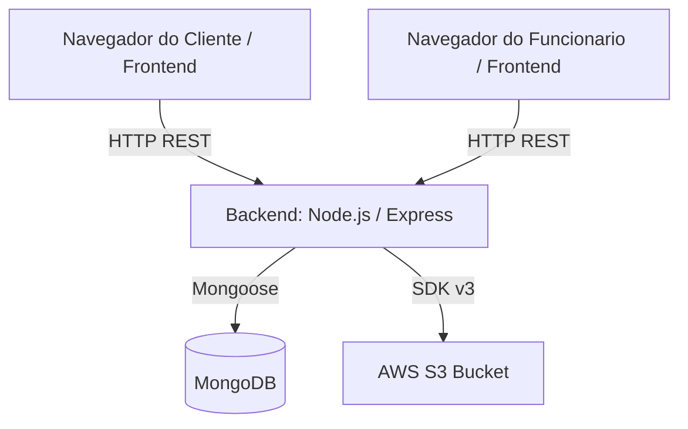
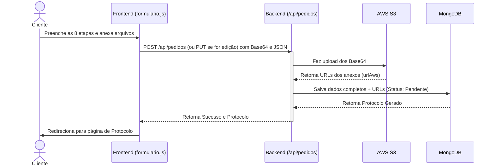
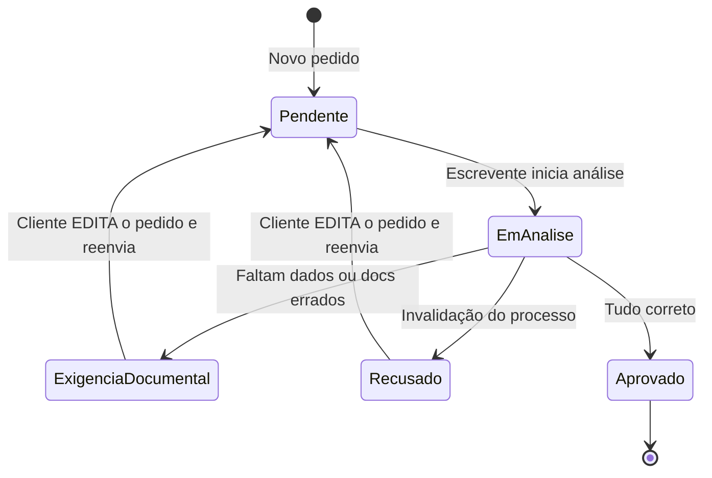
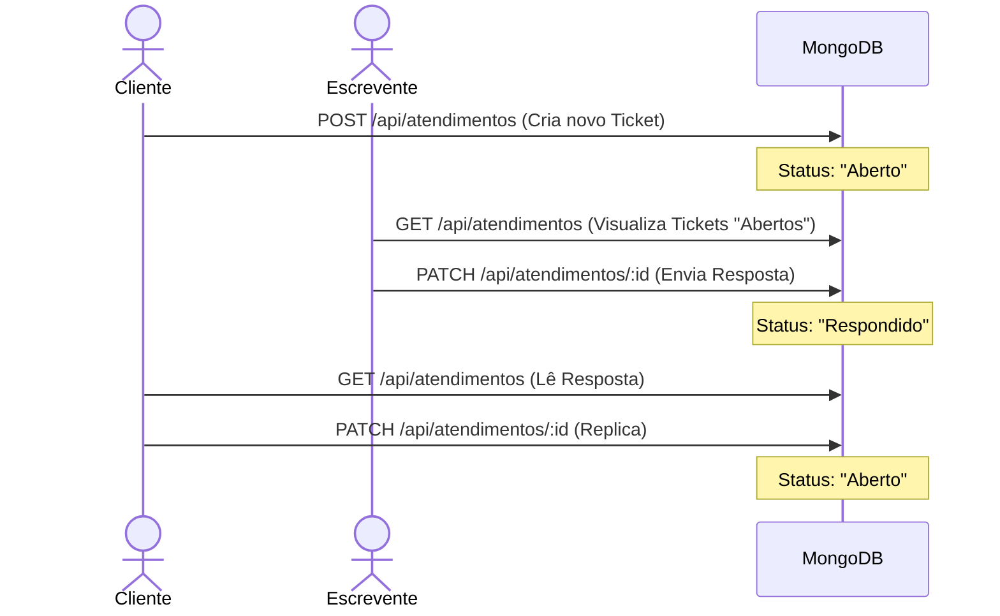

# SIGACRC - Documentação Técnica Completa

Bem-vindo à documentação técnica do projeto **SIGACRC** (Sistema Integrado de Gestão de Atendimento do Cartório de Registro Civil). Este documento detalha a arquitetura do sistema, o fluxo de dados e o funcionamento dos componentes chave da aplicação.

## 1. Visão Geral do Sistema
O **SIGACRC** é uma plataforma de modernização do atendimento de cartórios para dar início a processos de Casamento Civil de maneira digital. Ele engloba dois domínios principais:
- **Área Externa (Clientes):** Onde os noivos criam uma conta, preenchem as etapas do formulário de casamento, anexam documentos, acompanham status via protocolo e trocam mensagens com o cartório.
- **Área Interna (Cartório):** Onde Oficiais e Escreventes realizam login para analisar formulários, gerir exigências documentais, interagir com os noivos através do sistema de atendimento (chat) e administrar o quadro de funcionários.

## 2. Tecnologias Utilizadas
- **Frontend**: Vanilla JavaScript (ES6+), HTML5 Semântico, CSS3 (com propriedades customizadas para variáveis de temas, incluindo modo claro e escuro). Nenhuma biblioteca ou framework de interface externa (como React ou Bootstrap) é utilizada, privilegiando performance e redução de dependências.
- **Backend**: Node.js com framework **Express.js**.
- **Banco de Dados**: **MongoDB** utilizando a biblioteca **Mongoose** para modelagem de dados e esquemas rígidos de validação.
- **Armazenamento de Arquivos**: Integração real/mock com a **AWS S3** via `@aws-sdk/client-s3` para armazenamento dos anexos e geração de URLs públicas ou pré-assinadas.

## 3. Arquitetura da Solução

O projeto segue um modelo Cliente-Servidor baseado em API REST. O Frontend comunica-se exclusivamente com as rotas que começam em `/api/`.

## 4. Estrutura de Diretórios
O código segue uma separação rigorosa entre arquivos estáticos (servidos diretamente ao cliente) e lógicas de backend:

- `/public`: Raiz do Frontend.
  - `/assets`: Bibliotecas locais e arquivos JS utilitários globais (`sigacrc-storage.js`).
  - `/area_cliente`, `/central_ajuda`, `/login_clientes`, etc: Interfaces específicas para clientes.
  - `/formulario_casamento`: O maior módulo, subdividido em `etapas` que contém os micro-templates HTML carregados assincronamente pelo JavaScript.
  - `/painel_escrevente`, `/painel_oficial`: Interfaces para os funcionários.
- `/models`: Schemas Mongoose para padronização no banco (`Atendimento.js`, `Pedido.js`, `Usuario.js`).
- `/db`: Camada abstrata de acesso ao banco e funções helper (`atendimentosDb.js`, `pedidosDb.js`, `usuariosDb.js`).
- `/services`: Serviços externos (ex. `s3Service.js` para manipulação de objetos na AWS).
- `/server.js`: Ponto de entrada do backend. Contém a configuração do servidor Express, rotas da API, validação JWT de mentirinha (`x-user-id`) e rate limiting.

## 5. Fluxos Principais (Diagramas)

### A. Fluxo de Preenchimento do Pedido e Edição

### B. Avaliação e Exigência Documental (Funcionários)

### C. Sistema de Atendimentos (Chat Assíncrono)

Para minimizar ligações telefônicas, os clientes e escreventes comunicam-se via "Atendimentos".

## 6. Lógica de Componentes Importantes

### Autenticação Simplificada (`sigacrc-storage.js` e Headers)
O controle de sessão é feito no frontend através do `localStorage` e em `sessionStorage` para fluxos específicos.
Para comunicações com o servidor, o sistema transmite identificadores pelo cabeçalho HTTP `x-user-id` simulando um token em formato simples (ex: e-mail ou CPF, ou as strings de perfis `oficial`/`escrevente`). No arquivo `server.js`, existe o middleware `autenticar` que valida de maneira enxuta o acesso a rotas restritas.

### Integração ViaCEP
Para otimizar o tempo e a precisão do preenchimento das Etapas 3, 5 e 7, existe um helper que faz proxy para o `ViaCEP`. O backend hospeda um handler `/cep/:cep` que realiza o fetch com tratamento CORS e timeout, devolvendo para o `formulario.js` o endereço montado.

### Paginação no Frontend
Para tabelas longas (Painel do Escrevente e Oficial), o JavaScript nativo manipula *slices* de arrays de memória (`slice(inicio, fim)`), reconstruindo apenas as partes necessárias do DOM ao avançar ou retroceder páginas, evitando reflow desnecessário e *overfetching* no servidor.
