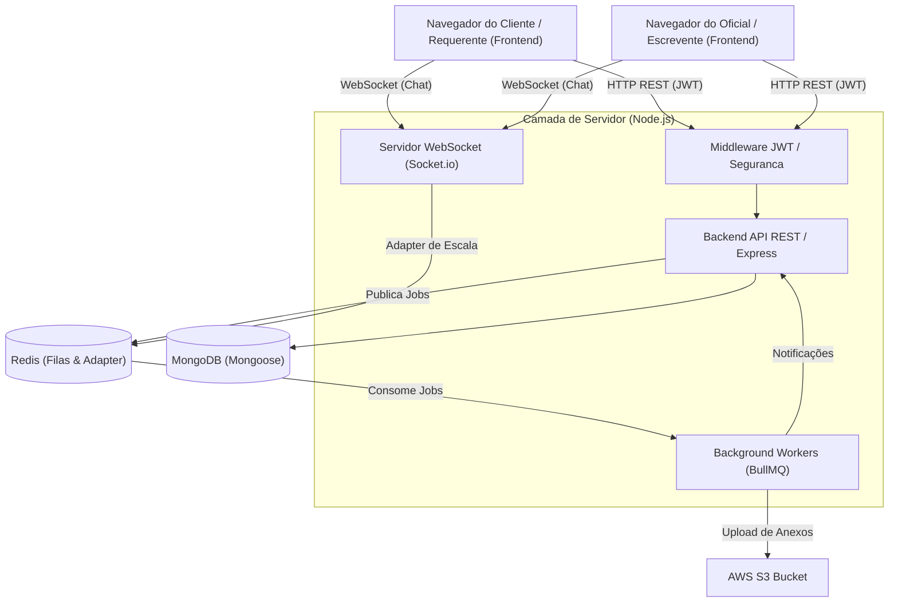
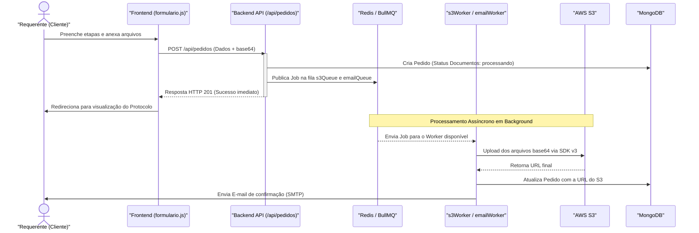
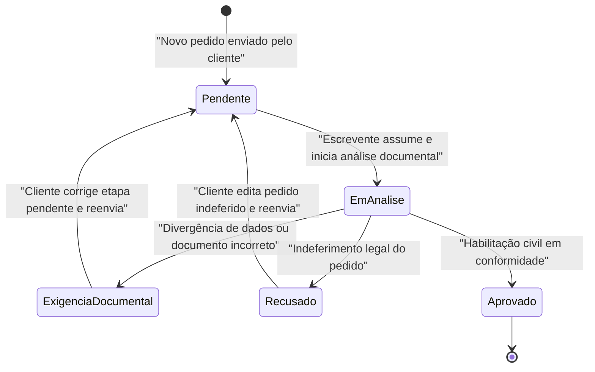
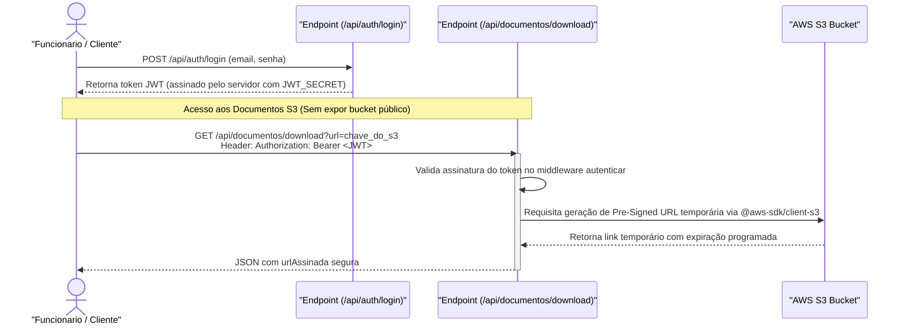
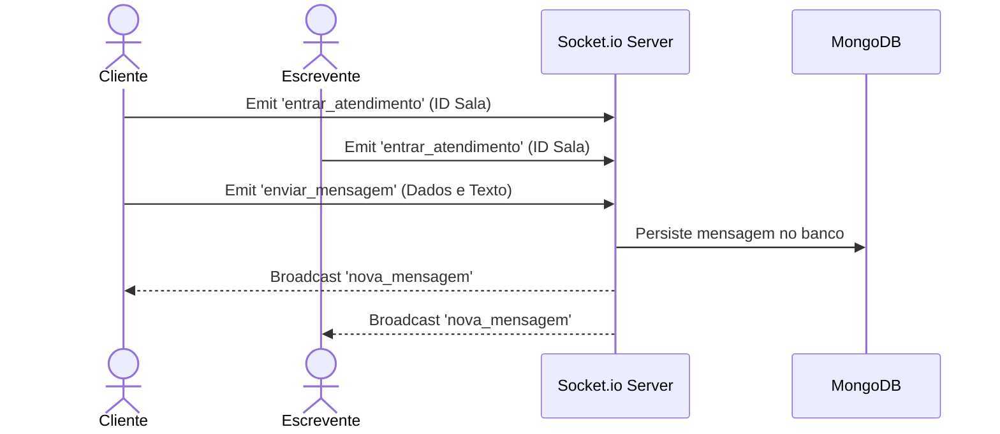

# SIGACRC — Documentação Técnica Completa

Bem-vindo à documentação técnica do projeto **SIGACRC** (Sistema Integrado de Gestão de Atendimento do Cartório de Registro Civil). Este documento detalha a arquitetura do sistema, o fluxo de dados, a segurança de autenticação via **JWT**, o sistema de auditoria e logging, a integração com **AWS S3** por **URLs Pré-Assinadas**, a suíte de **testes automatizados** e a conformidade com a **LGPD**.

---

## 1. Visão Geral do Sistema

O **SIGACRC** é uma plataforma concebida para a modernização e digitalização do atendimento de cartórios para processos de **Casamento Civil**. O ecossistema é dividido em dois domínios principais:
- **Área Externa (Clientes / Requerentes):** Onde os noivos criam conta autenticada, preenchem o formulário interativo em 8 etapas, realizam upload seguro de documentos civis, acompanham o trâmite processual por número de protocolo e interagem por chamado no módulo de "Atendimentos".
- **Área Interna (Cartório / Funcionários):** Onde Escreventes e Oficiais realizam autenticação administrativa para avaliar processos de casamento, aprovar ou solicitar **Exigência Documental**, gerenciar interações com os noivos no chat assíncrono e administrar o quadro de operadores.

---

## 2. Tecnologias Utilizadas

- **Frontend:** Vanilla JavaScript (ES6+), HTML5 Semântico e CSS3 com propriedades customizadas (suporte completo a temas claro e escuro). Não utiliza dependências ou frameworks de UI pesados (como React ou Bootstrap), assegurando leveza, alta performance e baixa latência de renderização.
- **Backend:** Node.js em conjunto com o framework **Express.js**, modularizado para fácil extensão e teste.
- **Banco de Dados:** **MongoDB** manipulado pela biblioteca **Mongoose**, que garante tipagem e validação estrita nos schemas.
- **Filas e Cache:** **Redis** em memória servindo como base de alta performance para mensageria e filas de processamento estruturadas pelo **BullMQ**.
- **Comunicação em Tempo Real:** **WebSocket** implementado através da biblioteca **Socket.io** com adaptador Redis para prover escalabilidade em clusters.
- **Armazenamento Seguro (AWS S3):** Integração com o bucket S3 via `@aws-sdk/client-s3`. Os documentos são mantidos em bucket privado, e a leitura é liberada por meio de **Pre-Signed URLs** temporárias emitidas com verificação de autorização no backend.
- **Autenticação & Autorização:** Uso da biblioteca `jsonwebtoken` para emissão de tokens **JWT** assinalados no login e validados em cada requisição protegida via cabeçalho `Authorization: Bearer <token>`.
- **Segurança da Aplicação:** Proteção de cabeçalhos HTTP com **Helmet** e mitigação contra ataques de força bruta ou negação de serviço via `express-rate-limit`.
- **Auditoria & Logging:** Registros consolidados de requisições e exceções via **Winston** e **Morgan** (`utils/logger.js`).
- **Testes Automatizados:** Suíte de testes unitários e de integração de API executados com **Jest** e **Supertest** (`__tests__/api.test.js`).

---

## 3. Arquitetura da Solução

O projeto segue a arquitetura Cliente-Servidor orientada a **API RESTful** em conjunto com comunicação em tempo real via **WebSocket**. O processamento de tarefas pesadas é delegado a *Background Workers*.

```mermaid
graph TD
    Client["Navegador do Cliente / Requerente (Frontend)"]
    Admin["Navegador do Oficial / Escrevente (Frontend)"]
    
    subgraph "Camada de Servidor (Node.js)"
        API["Backend API REST / Express"]
        WS["Servidor WebSocket (Socket.io)"]
        Auth["Middleware JWT / Seguranca"]
        Workers["Background Workers (BullMQ)"]
    end
    
    DB[("MongoDB (Mongoose)")]
    Redis[("Redis (Filas & Adapter)")]
    S3["AWS S3 Bucket"]
    
    Client -- "HTTP REST (JWT)" --> Auth
    Admin -- "HTTP REST (JWT)" --> Auth
    Client -- "WebSocket (Chat)" --> WS
    Admin -- "WebSocket (Chat)" --> WS
    
    Auth --> API
    API --> DB
    
    API -- "Publica Jobs" --> Redis
    WS -- "Adapter de Escala" --> Redis
    Redis -- "Consome Jobs" --> Workers
    
    Workers -- "Upload de Anexos" --> S3
    Workers -- "Notificações" --> API
```

---

## 4. Estrutura de Diretórios

O código é estritamente segregado entre arquivos estáticos de interface web e lógicas da camada de serviços e dados no backend:

- `/public`: Raiz dos arquivos estáticos do Frontend.
  - `/assets`: Bibliotecas JavaScript locais, ícones e utilitários globais (`sigacrc-storage.js`).
  - `/area_cliente`: Painel autenticado dos noivos.
  - `/formulario_casamento`: Módulo principal subdividido na pasta `etapas` contendo micro-templates HTML carregados dinamicamente via JS.
  - `/painel_escrevente` e `/painel_oficial`: Painéis operacionais dos funcionários do cartório.
  - `/protocolo`: Interface de consulta de situação e comprovantes do pedido.
- `/models`: Schemas estritos do Mongoose (`Atendimento.js`, `Pedido.js`, `Usuario.js`).
- `/db`: Camada de encapsulamento de operações no MongoDB (`atendimentosDb.js`, `pedidosDb.js`, `usuariosDb.js`, `connect.js`).
- `/services`: Provedores e conectores de terceiros (como `s3Service.js` para upload e geração de URLs da AWS S3).
- `/utils`: Utilitários globais do servidor, com destaque para o **sistema de logging** (`logger.js`).
- `/scripts`: Rotinas executadas via CLI para manutenção, como `backup.js` e scripts de migração de arquivos legados.
- `/__tests__`: Suíte de testes automatizados (`api.test.js`) de integração com **Jest** e **Supertest**.
- `/backups`: Diretório destinado ao armazenamento das exportações de segurança do MongoDB geradas pelo script de backup.
- `/diagramas`: Arquivos e especificações em Mermaid documentando processos conceituais do sistema.
- `server.js`: Ponto de entrada do servidor. Encapsula middlewares (CORS, Helmet, Morgan, Rate Limiting), rotas da API, middleware JWT de proteção `autenticar` e manipulador global de erros.
- `politica_lgpd.md`: Documento oficial de conformidade e tratamento de dados segundo a **Lei Geral de Proteção de Dados (LGPD)**.

---

## 5. Fluxos Principais (Diagramas)

### A. Fluxo de Preenchimento de Pedido e Upload Assíncrono

Para evitar travamento do servidor e timeout do lado do cliente com envio de arquivos pesados, o upload para a AWS S3 foi deslocado para o BullMQ de forma assíncrona.

```mermaid
sequenceDiagram
    actor Cliente as "Requerente (Cliente)"
    participant JS as "Frontend (formulario.js)"
    participant API as "Backend API (/api/pedidos)"
    participant Redis as "Redis / BullMQ"
    participant Worker as "s3Worker / emailWorker"
    participant S3 as "AWS S3"
    participant DB as "MongoDB"

    Cliente->>JS: Preenche etapas e anexa arquivos
    JS->>API: POST /api/pedidos (Dados + base64)
    activate API
    API->>DB: Cria Pedido (Status Documentos: processando)
    API->>Redis: Publica Job na fila s3Queue e emailQueue
    API-->>JS: Resposta HTTP 201 (Sucesso imediato)
    deactivate API
    JS->>Cliente: Redireciona para visualização do Protocolo
    
    Note over Redis,S3: Processamento Assíncrono em Background
    Redis-->>Worker: Envia Job para o Worker disponível
    Worker->>S3: Upload dos arquivos base64 via SDK v3
    S3-->>Worker: Retorna URL final
    Worker->>DB: Atualiza Pedido com a URL do S3
    Worker->>Cliente: Envia E-mail de confirmação (SMTP)
```

### B. Avaliação Processual e Exigência Documental

```mermaid
stateDiagram-v2
    [*] --> Pendente: "Novo pedido enviado pelo cliente"
    Pendente --> EmAnalise: "Escrevente assume e inicia análise documental"
    EmAnalise --> ExigenciaDocumental: "Divergência de dados ou documento incorreto"
    EmAnalise --> Recusado: "Indeferimento legal do pedido"
    EmAnalise --> Aprovado: "Habilitação civil em conformidade"
    
    ExigenciaDocumental --> Pendente: "Cliente corrige etapa pendente e reenvia"
    Recusado --> Pendente: "Cliente edita pedido indeferido e reenvia"
    Aprovado --> [*]
```

### C. Fluxo de Autenticação Segura (JWT) e Acesso Documental via Pre-Signed URL

```mermaid
sequenceDiagram
    actor Func as "Funcionario / Cliente"
    participant Auth as "Endpoint (/api/auth/login)"
    participant API as "Endpoint (/api/documentos/download)"
    participant S3 as "AWS S3 Bucket"

    Func->>Auth: POST /api/auth/login (email, senha)
    Auth-->>Func: Retorna token JWT (assinado pelo servidor com JWT_SECRET)
    
    Note over Func,API: Acesso aos Documentos S3 (Sem expor bucket público)
    Func->>API: GET /api/documentos/download?url=chave_do_s3<br/>Header: Authorization: Bearer <JWT>
    activate API
    API->>API: Valida assinatura do token no middleware autenticar
    API->>S3: Requisita geração de Pre-Signed URL temporária via @aws-sdk/client-s3
    S3-->>API: Retorna link temporário com expiração programada
    API-->>Func: JSON com urlAssinada segura
    deactivate API
```

### D. Sistema de Atendimentos (Chat em Tempo Real)

O cartório dispõe de um canal por chamados ("Atendimentos") que opera em tempo real utilizando WebSockets, eliminando long-polling e melhorando a experiência de comunicação entre o cliente e o escrevente.

```mermaid
sequenceDiagram
    actor Cliente
    actor Escrevente
    participant WS as Socket.io Server
    participant DB as MongoDB

    Cliente->>WS: Emit 'entrar_atendimento' (ID Sala)
    Escrevente->>WS: Emit 'entrar_atendimento' (ID Sala)
    
    Cliente->>WS: Emit 'enviar_mensagem' (Dados e Texto)
    WS->>DB: Persiste mensagem no banco
    WS-->>Cliente: Broadcast 'nova_mensagem'
    WS-->>Escrevente: Broadcast 'nova_mensagem'
```

---

## 6. Componentes & Módulos Chave

### Autenticação Segura por JWT (JSON Web Token)
Toda a comunicação autêntica foi modernizada para eliminar fallbacks inseguros e cabeçalhos legados (`x-user-id`).  
- **Emissão:** O login de requerentes (`/api/auth/login`) ou administrativos (`/api/usuarios/login-admin`) valida credenciais no MongoDB (e senhas protegidas via `bcryptjs`), emitindo um **JWT** assinado pela chave secreta `JWT_SECRET`.
- **Validação:** O middleware `autenticar` (em `server.js`) inspeciona obrigatoriamente o cabeçalho `Authorization: Bearer <token>`, decodifica o payload de identidade e anexa o usuário em `req.user`. Caso o token seja omisso ou inválido, a API responde de forma estrita com HTTP `401 Unauthorized` ou `403 Forbidden`.

### Segurança de Arquivos e URLs Pré-Assinadas (AWS S3)
Os anexos documentais exigem sigilo. O serviço `services/s3Service.js` interage através de `@aws-sdk/client-s3`.  
Em vez de disponibilizar arquivos de forma pública no S3, o backend expõe o endpoint `/api/documentos/download`. O escrevente ou titular solicita o download informando a referência, o servidor valida sua autorização JWT e gera uma **Pre-Signed URL** (URL Pré-Assinada) válida por tempo limitado, impedindo raspagem de documentos civis.

### Processamento Assíncrono com BullMQ e Redis
Para operações demoradas (como envio de e-mails automáticos via SMTP e upload de base64 pesados para a AWS S3), o servidor não mantém a conexão HTTP aguardando a finalização. Em vez disso, essas tarefas são imediatamente adicionadas a filas no **Redis** através do **BullMQ**. Serviços independentes (workers) consomem essas filas em background, reportando sucesso ou erro autonomamente sem impactar o tempo de resposta da API principal.

### Comunicação em Tempo Real com WebSocket
A interação direta entre requerentes e escreventes ocorre por meio de canais **WebSocket** mantidos pelo `socket.io`. A persistência das conversas ocorre de forma síncrona com o MongoDB antes do *broadcast* nas "salas" virtuais, garantindo registro histórico. Além disso, a utilização do `@socket.io/redis-adapter` permite a escalabilidade horizontal para futuros cenários onde a aplicação rode em múltiplas instâncias na nuvem.

### Auditoria e Logging Estruturado (Winston + Morgan)
Para observabilidade de produção, o módulo `/utils/logger.js` combina:
- **Winston:** Rastreamento estruturado de níveis de log (`info`, `warn`, `error`).
- **Morgan:** Conectado como fluxo de entrada do Winston, registrando todas as requisições HTTP entrantes (verbo, rota, status e tempo de resposta).
- **Error Handler Global:** Um middleware de captura de exceções `500` no Express grava as stack traces completas no log e previne vazamento de detalhes internos na resposta JSON ao cliente.

### Testes Automatizados (`Jest` + `Supertest`) e Rotina de Backup
A confiabilidade da API é inspecionada pela suíte de testes em `__tests__/api.test.js`, executada com `npm test`. Os testes testam ponta a ponta:
- Respostas corretas de login e recusa a senhas erradas.
- Criação autenticada de pedidos de casamento.
- Rejeição contundente (`403 Access Denied`) a chamadas desprovidas do cabeçalho `Authorization: Bearer <token>`.
- Emissão simulada (ou conectada) de URLs Pré-Assinadas do S3.

O sistema dispõe também de uma rotina automatizada em `scripts/backup.js` (`npm run backup`) que salva o estado das coleções do banco em arquivos consolidados no diretório `/backups/`.

### Conformidade Legal e LGPD
Em observância à **Lei Geral de Proteção de Dados (Lei nº 13.709/2018)**, o tratamento de dados civis sensíveis do SIGACRC é orientado pela nossa [Política LGPD](./politica_lgpd.md), com diretrizes claras de consentimento, finalidade registral, tempo de retenção e garantias de confidencialidade de anexos.

### Integração ViaCEP
Para os formulários de casamento (Etapas de preenchimento de endereço e naturalidade), o sistema implementa um proxy otimizado na rota `/cep/:cep`, que consulta o serviço ViaCEP garantindo tratamento adequado de falhas, sanitização local e preenchimento ágil no frontend sem bloqueios de CORS.
